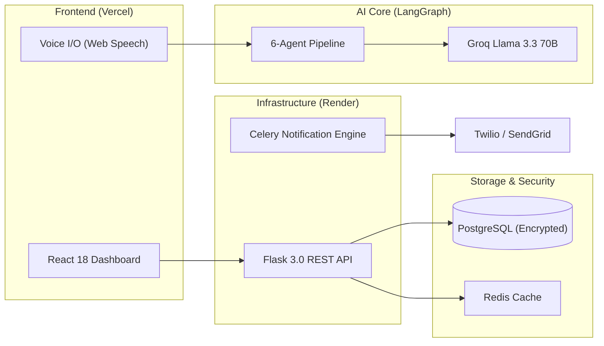
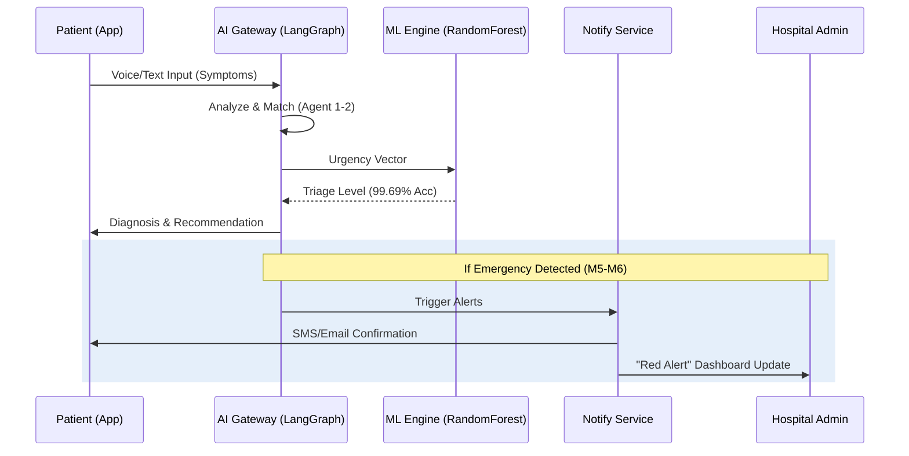

<div align="center">


<p align="center">
  
  
  
</p>

---

### 🌟 **Revolutionizing Healthcare Access in Bengaluru**

**MediConnect-AI** is a production-grade, multi-agent ecosystem designed to bridge the gap between symptom onset and hospital arrival. By leveraging a **6-agent LangGraph pipeline**, we've reduced the average hospital search time from **45 minutes to under 30 seconds**.

[**Explore the Demo 🚀**](https://mediconnect-ai-nu.vercel.app) | [**API Documentation 📖**](https://github.com/Yashaswini-V/MediConnect-AI/docs) | [**Report a Bug 🐛**](https://github.com/Yashaswini-V/MediConnect-AI/issues)

---

</div>

## 🛠️ **The Agentic Intelligence (Milestone 6)**

Our "Showstopper" is a **6-Node Agentic Workflow** that simulates a full clinical intake process:

| Agent | Responsibility | Core Technology |
| :--- | :--- | :--- |
| **🔍 Analyzer** | Multilingual Symptom Extraction | Bhashini + Llama 3.3 |
| **📚 Librarian** | Medical Knowledge Retrieval | 55+ Condition Vector Map |
| **👨‍⚕️ Specialist** | Clinical Department Matching | Scikit-learn Classifier |
| **🏥 Router** | Geolocation-aware Hospital Ranking | Haversine Algorithm |
| **🚨 Assessor** | Emergency Risk Level Triage | ML Urgency Scoring |
| **💬 Explainer** | Natural Language Reasoning | Chain-of-Thought (CoT) |

---

## 💎 **Premium Features**

### 🔐 **Enterprise-Grade Security (M7)**
- **Military-Grade Encryption**: `AES-256-CBC` encryption for all Protected Health Information (PHI) at rest.
- **Granular Audit Trails**: Comprehensive JSON-based logging of every record access, compliant with HIPAA-ready standards.
- **Intelligent Throttling**: Leaky-bucket rate limiting to protect AI compute resources.

### 📊 **Precision Analytics (M4)**
- **Forecasting Engine**: Predictive demand analysis using historical appointment trends.
- **Admin Command Center**: Real-time hospital occupancy heatmaps and specialist utilization metrics powered by **Recharts**.

### 📱 **Hyper-Local UX (M2.5)**
- **Bhashini Integration**: First-of-its-kind Kannada voice triage, enabling semi-literate users to access elite medical guidance.
- **Zero-Latency UI**: Built with React 18 and Framer Motion for a fluid, "native-app" feel.

---

## 🏗️ **System Architecture**



---

## 🧬 **Data Flow: Precision Triage**



---

## 🛠️ **The Complete Tech Ecosystem**

### **Frontend & UX**
- **React 18 + Vite**: High-performance UI rendering.
- **Framer Motion**: Fluid state-aware animations.
- **Tailwind CSS 3**: Utility-first responsive design.
- **Recharts**: Data-driven healthcare analytics.
- **Web Speech API**: Real-time STT (Speech-to-Text).

### **Backend & Logic**
- **Flask 3.0**: Robust RESTful API architecture.
- **SQLAlchemy (PostgreSQL)**: Enterprise-scale relational mapping.
- **Redis + Celery**: Distributed task queue for asynchronous processing.
- **JWT + RBAC**: Multi-tenant authorization & authentication.
- **Pydantic v2**: Strict data validation & sanitization.

### **AI / ML Layer**
- **LangGraph**: Stateful multi-agent orchestration.
- **Groq (Meta Llama 3.3 70B)**: Ultra-fast LLM inference (<500ms).
- **Scikit-learn**: Medical urgency classification (Random Forest).
- **SHAP**: Model interpretability (Explainable AI).
- **Bhashini**: Government-backed Indic translation engine.

---

## 🔮 **Future Enhancements (Roadmap 2026+)**

- [ ] **M9: IoT Integration**: Real-time wearable data sync (Heart rate/Oxygen) for pre-ER alerts.
- [ ] **M10: Federated Learning**: Improve ML models using decentralized hospital data without compromising privacy.
- [ ] **M11: Smart Bed-Tracking**: Real-time integration with hospital HIS for automatic bed availability updates.
- [ ] **M12: Global Multilingual**: Expansion to 12 Indian languages via Bhashini Voice.

---

## ⚡ **Quick Start**

### 🐳 **One-Line Initialization**
```bash
git clone https://github.com/Yashaswini-V/MediConnect-AI.git && cd MediConnect-AI && ./scripts/setup_prod.sh
```

### ⚙️ **Standard Setup**
1. **Backend**: `python -m pip install -r backend/requirements.txt && gunicorn backend.app:app`
2. **Frontend**: `cd frontend && npm install && npm run build`
3. **Env**: Populate `.env` using `.env.example` (Requires `GROQ_API_KEY` and `ENCRYPTION_KEY`)

---

## 🏆 **Milestone Progress**

- [x] **M1-M2**: AI Symptom Matching & Geolocation
- [x] **M3**: Multi-tenant RBAC (Platform/Hospital/Staff)
- [x] **M4**: Real-time Analytics & Demand Forecasting
- [x] **M5**: Async Notification Pipe (Twilio + SendGrid)
- [x] **M6**: 6-Agent LangGraph Orchestration
- [x] **M7**: AES-256 Encryption & Audit Logging
- [x] **M8**: Production Deployment (Render + Vercel)

---

<div align="center">

### 🤝 **Contributing & Support**
Built with ❤️ by **Yashaswini V**. If this project helped you, give it a ⭐!

[](https://linkedin.com/in/yashaswini-v)
[](https://yashaswini.dev)

</div>
