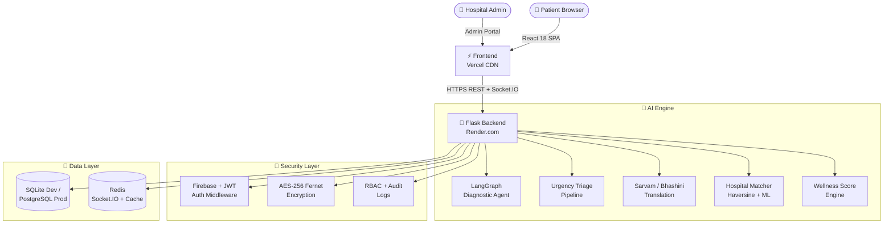
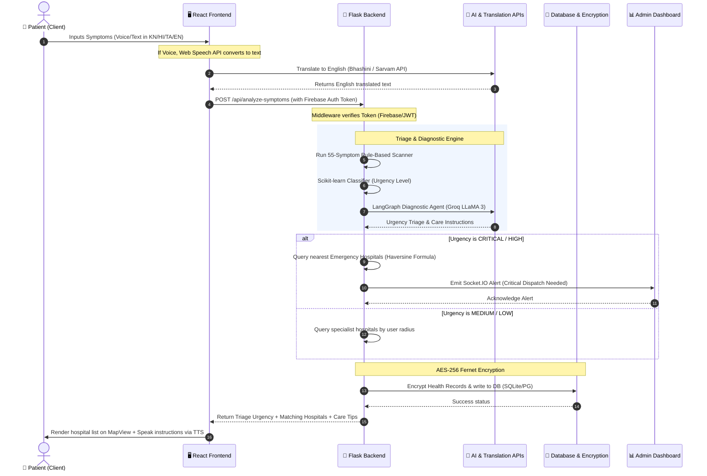

<!--
  ╔══════════════════════════════════════════════════════════════╗
  ║          MediConnect AI  ·  Academic Project README          ║
  ║          IBM SkillBuild × Edunet Foundation · 2026           ║
  ╚══════════════════════════════════════════════════════════════╝
-->

<div align="center">

<!-- ═══════════════  HERO HEADER  ═══════════════ -->


*Intelligent symptom triage · Hospital matching · Multilingual care · Real-time emergency dispatch*

<br/>

<!-- ═══════════════  BADGES  ═══════════════ -->

[](https://github.com/Yashaswini-V21/MediConnect-AI/actions/workflows/ci.yml)
&nbsp;
[](LICENSE)
&nbsp;
[](https://python.org)
&nbsp;
[](https://react.dev)
&nbsp;
[](https://flask.palletsprojects.com)
&nbsp;
[](https://mediconnect-ai-nu.vercel.app)

<br/>

<!-- ═══════════════  CTA ROW  ═══════════════ -->

[**🚀 Live Demo**](https://mediconnect-ai-nu.vercel.app)
&emsp;|&emsp;
[**📡 API Reference**](#-api-reference)
&emsp;|&emsp;
[**⚡ Quick Start**](#-quick-start)
&emsp;|&emsp;
[**🚢 Deploy**](#-deployment)

<br/>

</div>

---

<!-- ═══════════════  ACADEMIC CONTEXT  ═══════════════ -->

## 🎓 Academic Context

<div align="center">

| Field | Detail |
|---|---|
| **Programme** | IBM SkillBuild × Edunet Foundation — AIML Virtual Internship |
| **Project Type** | Full-Stack AI Healthcare Platform (Capstone) |
| **Domain** | Healthcare AI · Natural Language Processing · Cloud Deployment |
| **Tech Stack** | Flask · React 18 · LangGraph · Groq LLaMA · Firebase · SQLite/PostgreSQL |
| **Developer** | Yashaswini V |

</div>

---

## ✨ What is MediConnect AI?

MediConnect AI puts an AI-powered medical guidance system in every patient's hands. In under **30 seconds**, a patient describes their symptoms in natural language, receives a clinical urgency assessment, and is matched to the nearest appropriate hospital — all within their browser, multilingually, without needing to call anyone.

> *"Built to bridge the gap between patients and the right care, at the right time, in the right language."*

---

## 🌟 Feature Overview

<div align="center">

| # | Feature | Description |
|---|---|---|
| 🩺 | **AI Symptom Triage** | Rule-based + LangGraph multi-agent pipeline classifies urgency (LOW / MEDIUM / HIGH / CRITICAL) from natural language input |
| 🏥 | **Hospital Matching** | Haversine distance + specialty filtering across **46 verified Karnataka hospitals** |
| 💬 | **AI Doctor Chat Bot** | Floating chat assistant with 15+ healthcare topics, bilingual EN/KN |
| 🌏 | **Multilingual Interface** | Sarvam AI + Bhashini integration for Kannada, Hindi, Tamil |
| 📊 | **Wellness Score** ✨ | Personalised 0–100 health score with category breakdown and AI-generated tips |
| 🚨 | **Emergency SOS** | One-tap location sharing + automatic dial 108 with countdown |
| 📅 | **Appointment System** | Full booking lifecycle: PENDING → CONFIRMED → COMPLETED → CANCELLED |
| 🛡️ | **Security** | AES-256 encryption, JWT + Firebase Auth, role-based access, audit logs |
| 📈 | **Admin Dashboard** | Real-time Socket.IO analytics, doctor & appointment management, RBAC |
| 🔊 | **Voice Interface** | Speech-to-text input + TTS output, language-switchable |

</div>

4. Run backend (development):

## 🖥️ Screenshots

<div align="center">

**Landing Page — Hero Section**


<br/>

**About & Platform Overview**


<br/>

**AI Symptom Checker**


<br/>

**Patient Profile & Health Dashboard**&emsp;&emsp;&emsp;&emsp;**Book Appointment**


</div>

---

## 🎨 UI & Component Design

### 🔹 Navigation Header Design
The Header is designed as a premium sticky navigation bar (`sticky top-0`) that leverages modern translucent effects (`backdrop-blur-md`) to blend seamlessly with the content below.
- **Glassmorphism Styling**: Uses `bg-white/95 dark:bg-slate-900/95` and thin borders (`border-slate-200/80 dark:border-slate-800/80`) to support light and dark modes natively.
- **Dynamic Active Highlighting**: Navigation buttons automatically monitor route changes and highlight the current page dynamically (active pages feature `bg-purple-50 dark:bg-purple-900/30 text-purple-700 dark:text-purple-300`).
- **Feature Indicators**: Specialized items such as the **Wellness Score** display a glowing `✨` badge, while the **Emergency SOS** uses warning red styling (`text-red-600 dark:text-red-400 hover:bg-red-50 dark:hover:bg-red-900/20`) to draw instant attention.
- **Responsive Drawer**: Incorporates a mobile-friendly menu button toggling an animated slide-down navigation view with proper accessibility states.
- **Integrated Utilities**: Embedded theme toggle (light/dark) and language selection dropdown are anchored directly to the user utility list.
- **Authenticated States**: Showcases a customizable favourites list (`Heart`), a real-time notification indicator (`Bell` with badge), and a clean `LogOut` route.

### 🔹 Page Footer Design
The Footer provides structural completeness and clinical assurance, styled with a modern dark theme (`bg-gradient-to-b from-slate-900 to-black`) and an illuminated accent divider.
- **Academic Context**: Highlights a prominent partnership badge (**IBM SkillBuild × Edunet Foundation**) alongside platform credentials like "AES-256 Encrypted · RBAC Secured".
- **4-Column Grid Layout**:
  - *Column 1 (Brand Info)*: Platform description, badges, and social media/live links.
  - *Column 2 (Quick Navigation)*: Quick links to key workspace segments (Symptom Checker, Find Hospitals, Appointments).
  - *Column 3 (AI Features)*: Advanced resources (AI Skincare, Medicine Reminders, AI Doctor Chat, First Aid Guide).
  - *Column 4 (Emergency Helplines)*: Renders direct emergency numbers as high-contrast hoverable interactive cards.
- **Emergency Helpline Cards**: Quick dial integration for:
  - 🚨 National Emergency (**108**)
  - 🚑 Medical / Ambulance (**102**)
  - 👮 Police (**100**)
  - 💜 Women Helpline (**1091**)

---

## 🏗️ System Architecture



5. Run frontend (development):

## 🔄 System Data Flow (How It Works)

The data flow diagram below illustrates how user requests move from speech/text input through translation, authentication, multi-agent AI processing, hospital matching, data persistence, and live dashboard telemetry.



### Detailed Functional Walkthrough
1. **Multilingual Input Handling**: The user inputs symptoms via keyboard or voice (powered by HTML5 Web Speech API). If the input is in a regional language (Kannada, Hindi, Tamil), the frontend makes an asynchronous request to the **Sarvam AI / Bhashini Translation API** to convert the description to English.
2. **Secure API Transport**: The frontend packages the payload and sends it to the backend via HTTPS, attaching the Firebase ID Token / custom JWT in the `Authorization` header.
3. **Authentication & Decryption**: The Flask backend authenticates the token via the middleware. All subsequent reads/writes of sensitive patient health information are encrypted at rest using **AES-256 Fernet symmetric keys**.
4. **Intelligent Urgency Classification**:
   - The *Rule-based module* parses 55 specific symptom keywords.
   - The *Scikit-learn model* predicts the base triage category.
   - The *LangGraph Multi-Agent system* (interfaced with Groq LLaMA 3) provides clinical context and returns structured triage classifications (`LOW`, `MEDIUM`, `HIGH`, `CRITICAL`).
5. **Hospital Specialty Matching**: If the urgency requires medical attention, the backend calculates distance using the **Haversine formula** between the patient's lat/lng coordinates and coordinates of 46 verified healthcare institutions. It filters them dynamically by required specialization.
6. **Real-time Event Emission**: For critical cases, the backend immediately emits a live notification payload over **Socket.IO** to the admin portal, alerting nearby support personnel.
7. **Interactive Presentation**: The frontend maps the results on the `MapView` page, lists nearby options, and activates a **Text-to-Speech (TTS)** engine to read out safety protocols and instructions.

---

## 📂 Project Structure

```
MediConnect-AI/
├── 📁 backend/                      Flask API Server
│   ├── app.py                       Entry point + blueprint registry
│   ├── config.py                    Dev / Prod config classes
│   ├── 📁 models/
│   │   ├── symptom_analyzer.py      55-symptom rule-based engine
│   │   ├── hospital_matcher.py      Haversine + specialty matching
│   │   ├── ml_classifier.py         Scikit-learn urgency classifier
│   │   ├── admin_model.py           M3 admin schemas + state machine
│   │   └── user_model.py            User + search history schemas
│   ├── 📁 routes/
│   │   ├── auth_routes.py           Firebase + JWT auth
│   │   ├── symptom_routes.py        Symptom analysis API
│   │   ├── hospital_routes.py       Hospital search + details
│   │   ├── appointment_routes.py    Booking management API
│   │   ├── ai_platform_routes.py    LangGraph + voice API
│   │   ├── admin_routes.py          Admin portal (RBAC)
│   │   └── wellness_routes.py  ✨   Wellness Score API
│   ├── 📁 utils/
│   │   ├── security.py              AES-256, audit logs, CSP headers
│   │   ├── auth_middleware.py       Firebase-first + JWT fallback
│   │   ├── diagnostic_agent.py      LangGraph multi-agent pipeline
│   │   └── ...                      Caching, analytics, voice, TTS
│   ├── requirements.txt
│   └── Dockerfile
│
├── 📁 frontend/                     React 18 SPA
│   └── src/
│       ├── 📁 pages/                17 feature pages
│       │   ├── WellnessScore.jsx ✨ New — animated health gauge
│       │   ├── SymptomChecker.jsx
│       │   ├── Appointments.jsx
│       │   ├── Emergency.jsx
│       │   └── 📁 admin/            7 admin portal pages
│       ├── 📁 components/
│       │   ├── common/              Header ✦ Footer ✦ Auth Guards
│       │   └── features/            AIDoctorBot ✦ EmergencySOS
│       └── 📁 services/             Axios + Firebase client
│
├── .github/workflows/ci.yml         CI: lint · build · secret scan · docker
├── docker-compose.yml               Full local stack
├── render.yaml                      Render.com deployment blueprint
└── vercel.json                      Vercel frontend deployment config
```

---

## ⚡ Quick Start

### Prerequisites
- **Python 3.11+** &nbsp;·&nbsp; **Node.js 18+** &nbsp;·&nbsp; **Git**

### 1 · Clone

```bash
git clone https://github.com/Yashaswini-V21/MediConnect-AI.git
cd MediConnect-AI
```

### 2 · Backend

```bash
cd backend
python -m venv .venv
# Windows:
.venv\Scripts\activate
# macOS / Linux:
source .venv/bin/activate

pip install -r requirements.txt
cp .env.example .env        # Fill in your API keys
python app.py               # → http://localhost:5000
```

### 3 · Frontend

```bash
cd frontend
npm install
cp .env.example .env        # Add Firebase config
npm start                   # → http://localhost:3000
```

### 4 · Docker (one command)

```bash
docker-compose up --build -d
# Backend  → localhost:5000
# Frontend → localhost:3000
```

---

## 🔑 Environment Variables

### Backend (`backend/.env`)

| Variable | Required | Description |
|---|:---:|---|
| `SECRET_KEY` | ✅ | Flask session signing key |
| `JWT_SECRET_KEY` | ✅ | JWT token signing key |
| `ENCRYPTION_KEY` | ✅ | AES-256 Fernet key |
| `ADMIN_SECRET_TOKEN` | ✅ | Admin portal access token |
| `GROQ_API_KEY` | ⭐ | LLaMA 3 via Groq (clinical AI) |
| `SARVAM_API_KEY` | ⭐ | Sarvam AI multilingual translation |
| `FIREBASE_PROJECT_ID` | ⭐ | Firebase Auth project |
| `DATABASE_URL` | — | PostgreSQL URI (defaults SQLite) |
| `REDIS_URL` | — | Redis for Socket.IO + rate limiting |

### Frontend (`frontend/.env`)

| Variable | Required | Description |
|---|:---:|---|
| `REACT_APP_API_URL` | ✅ | Backend base URL |
| `REACT_APP_FIREBASE_*` | ✅ | Firebase web app config (6 vars) |

---

## 📡 API Reference

### Core Endpoints

| Method | Endpoint | Auth | Description |
|---|---|:---:|---|
| `GET` | `/api/health` | — | Service health check |
| `POST` | `/api/analyze-symptoms` | — | Symptom analysis + urgency triage |
| `POST` | `/api/search` | — | Combined symptom + hospital search |
| `POST` | `/api/hospitals/search` | — | Hospital search by specialty + location |
| `POST` | `/api/hospitals/emergency` | — | Nearest emergency hospitals |
| `POST` | `/api/translate` | — | EN/KN/HI/TA translation |

### Auth

| Method | Endpoint | Description |
|---|---|---|
| `POST` | `/api/auth/register` | Patient registration |
| `POST` | `/api/auth/login` | Login → JWT token |
| `GET` | `/api/auth/profile` | Get authenticated profile |

### Appointments

| Method | Endpoint | Auth | Description |
|---|---|:---:|---|
| `POST` | `/api/appointments/book` | 🔒 | Book appointment |
| `GET` | `/api/appointments/my` | 🔒 | List user appointments |
| `PUT` | `/api/appointments/:id/cancel` | 🔒 | Cancel appointment |

### ✨ Wellness Score (New)

| Method | Endpoint | Auth | Description |
|---|---|:---:|---|
| `GET` | `/api/wellness/score` | Optional | Personalised score 0–100 |
| `GET` | `/api/wellness/history` | 🔒 | 7-day symptom trend |

> **Query params:** `?bmi=22.5&sleep_hours=7&exercise_days=4`

### AI Platform

| Method | Endpoint | Description |
|---|---|---|
| `POST` | `/api/ai/health/analyze` | LangGraph diagnostic agent |
| `POST` | `/api/ai/health/emergency-check` | Quick emergency detection |

### Admin (RBAC Required)

| Method | Endpoint | Role | Description |
|---|---|---|---|
| `POST` | `/api/admin/login` | — | Admin login |
| `GET` | `/api/admin/appointments` | Hospital Admin+ | All appointments |
| `GET` | `/api/admin/doctors` | Hospital Admin+ | Doctor list |
| `GET` | `/api/admin/analytics/overview` | Any Admin | Analytics data |

---

## 🔐 Security Architecture

| Layer | Implementation |
|---|---|
| **Encryption at Rest** | AES-256 Fernet — all patient health data encrypted before DB write |
| **Authentication** | Firebase ID Token verification with JWT fallback |
| **Authorization** | Role-Based Access Control: Platform Admin / Hospital Admin / Support Staff |
| **Audit Trail** | Every read/write action logged with user, IP, timestamp, success/fail |
| **HTTP Security** | CSP · HSTS · X-Frame-Options · Permissions-Policy · Referrer-Policy |
| **Rate Limiting** | 1 000 req/hour per IP via Flask-Limiter (Redis-backed in production) |
| **Input Sanitisation** | All endpoints validate and sanitise inputs before processing |
| **CORS** | Explicit origin allowlist in production, wildcard in dev |
| **Secrets** | Never hardcoded — all via env vars or CI secrets |

---

## 🚀 Deployment

### 🖥️ Frontend → Vercel

The frontend is configured to build dynamically from the root workspace or a subfolder via [vercel.json](file:///c:/MediConnect-AI/vercel.json):
- **Build Script**: `npm install --prefix frontend && npm run build --prefix frontend` builds the React application.
- **Output Folder**: `frontend/build` is served statically.
- **Client-Side Routing Support**: Single Page Application (SPA) routing is supported by mapping all path requests back to the entry template:
  ```json
  "rewrites": [
    { "source": "/(.*)", "destination": "/index.html" }
  ]
  ```
- **Configuration**:
  1. Add `REACT_APP_API_URL` pointing to your deployed backend URL (e.g., `https://mediconnect-backend.onrender.com`).
  2. Map all React-App-Firebase configuration variables.

### 🐍 Backend → Render

The backend Flask API is defined via [render.yaml](file:///c:/MediConnect-AI/render.yaml) for automatic infrastructure provisioning:
- **Service Specs**: Runs as a Python Web Service on the free tier using `singapore` region (nearest to Indian servers).
- **Execution Script**: Uses multi-threaded `gunicorn`:
  ```bash
  cd backend && gunicorn --worker-class gthread --workers 2 --threads 4 --timeout 120 app:app
  ```
- **Automatic Postgres Database Provisioning**: Provisions a PostgreSQL instance named `mediconnect-db` and maps the connection credentials dynamically to the backend using `DATABASE_URL`.
- **Environment Generation**: Cryptographic keys (`SECRET_KEY`, `JWT_SECRET_KEY`, `ENCRYPTION_KEY`, `ADMIN_SECRET_TOKEN`) are auto-generated on creation.
- **API Keys**: Manual configuration of `GROQ_API_KEY`, `SARVAM_API_KEY` is required in the Render console.

### 🐳 Self-Hosted Docker

```bash
docker-compose up --build -d
```

---

## 🛠️ CI/CD Pipeline & Quality Assurance

The project includes a robust automated GitHub Actions workflow at `.github/workflows/ci.yml` that triggers on push and pull requests. It guarantees high code quality and stable releases through multi-stage validations:

1. **Backend Verification & Syntax Auditing**:
   - Compiles Python files to ensure syntax correctness (`compileall`).
   - Automatically detects and installs dependencies while dynamically filtering Windows-specific packages (e.g., `pywin32`, `pyttsx3`) to maintain Linux runner compatibility.
   - Runs diagnostic smoke tests validating the rule-based symptom analyzer and distance matcher.

2. **Frontend Production Build Compilation**:
   - Performs automated Node installation and dependency resolution via `npm ci`.
   - Compiles and validates the production React build.
   - Checks ESLint compliance and validates build output structures.

3. **Automated Secret Scanner**:
   - Continuously scans the codebase for accidentally exposed API keys (Firebase, Groq, Sarvam, etc.) to safeguard repository integrity.

---

## 🔮 Future Roadmaps & Enhancements

To expand the capabilities of MediConnect AI for larger-scale regional deployments, the following academic and architectural enhancements are planned:

- **🔗 Blockchain-Powered EHR Integration**: Implement Hyperledger Fabric or Ethereum smart contracts to store and share patient diagnostic histories securely and immutably between matched hospital centers.
- **🛡️ Federated Machine Learning**: Train triage classifiers locally on client hospital nodes (using flower framework) to preserve patient privacy while improving the urgency detection model.
- **🚀 Real-Time IoT Ambulance Dispatch**: Integrate with emergency vehicle IoT trackers to dispatch the nearest active ambulance dynamically while streaming the patient's real-time vital signs directly to the receiving emergency ward.
- **👓 AR Hospital Wayfinding**: Build inside-clinic augmented reality routing within the React client using WebXR, helping patients locate matched diagnostic labs or specialty chambers upon arrival.
- **🧠 Advanced Clinical LLM Agents**: Upgrade the diagnostic agent to specialized healthcare models (such as BioBERT or Med-PALM 2) to increase symptom parsing accuracy for rare medical conditions.
- **📶 Offline-First Diagnostics**: Develop a lightweight WebAssembly symptom-matching model that runs locally on the browser without internet connectivity, supporting rural or remote regions.

---

## 🧪 Verification

```bash
# Full backend component verification
python verify_setup.py

# Python syntax check
python -m compileall backend -q

# Database schema tests
python -m pytest backend/test_m3_schema.py -v

# Frontend production build (must be 0 errors)
cd frontend && npm run build
```

---

## 🤝 Contributing

1. Fork the repository
2. Create your branch: `git checkout -b feat/my-feature`
3. Commit with semantic messages: `git commit -m 'feat: add my feature'`
4. Push and open a Pull Request against `main`

---

<!-- ═══════════════  FOOTER  ═══════════════ -->

<div align="center">

<br/>

**MediConnect AI** &nbsp;·&nbsp; IBM SkillBuild × Edunet Foundation AIML Internship Capstone

Built with ❤️ in India &nbsp;·&nbsp; [GitHub](https://github.com/Yashaswini-V21/MediConnect-AI) &nbsp;·&nbsp; [Live Demo](https://mediconnect-ai-nu.vercel.app)

<br/>

*© 2026 Yashaswini V. Licensed under MIT.*

<br/><br/>


</div>
