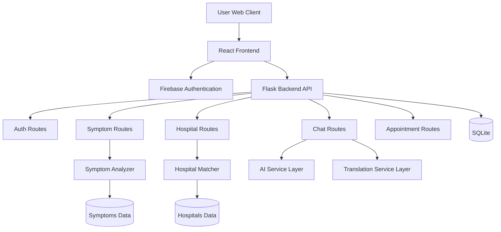
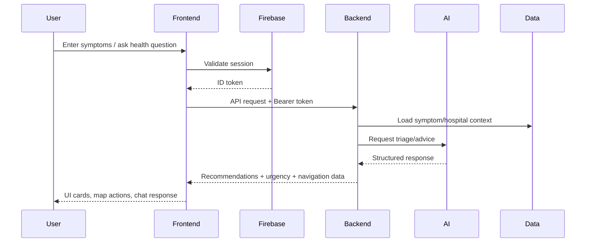
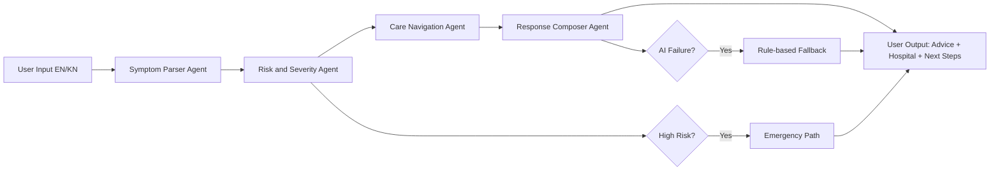
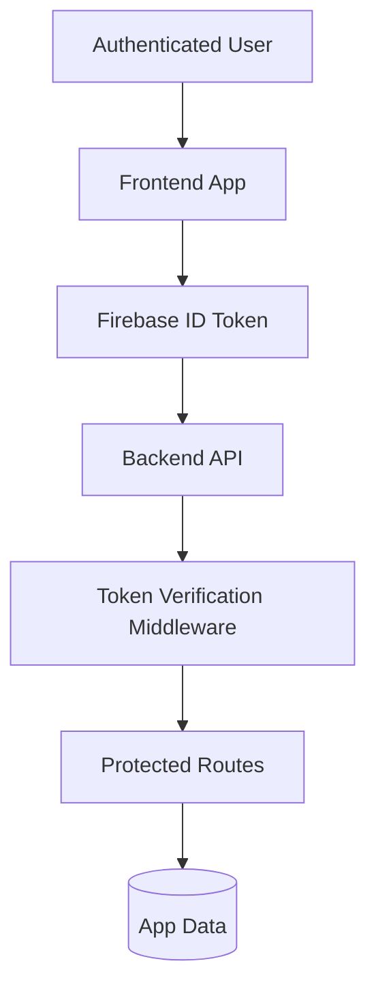

# MediConnect AI

<div align="center">

[](LICENSE)
[](frontend)
[](backend)
[](https://firebase.google.com/)
[](https://skillsbuild.org/)

AI-powered healthcare navigation platform for faster, safer, and multilingual access to care.

[Quick Start](#quick-start) | [Architecture](#system-architecture) | [Data Flow](#data-flow-diagram) | [Tech Stack](#tech-stack)

</div>

## About Project
MediConnect AI is a full-stack healthcare assistant that helps users analyze symptoms, discover hospitals, and navigate emergency situations in English and Kannada with an AI-supported experience.

## Internship Capstone Context
- Program: IBM SkillBuild AIML Internship
- Partner: Edunet Foundation
- Project Type: Capstone Project
- Focus: Real-world healthcare accessibility with AI/ML, multilingual UX, and emergency-first workflows

## Table of Contents
- [Key Highlights](#key-highlights)
- [What Is New](#what-is-new)
- [Core Features](#core-features)
- [System Architecture](#system-architecture)
- [Data Flow Diagram](#data-flow-diagram)
- [Agentic Lightning Flow](#agentic-lightning-flow)
- [Security and Privacy](#security-and-privacy)
- [Tech Stack](#tech-stack)
- [Project Structure](#project-structure)
- [Quick Start](#quick-start)
- [Environment Configuration](#environment-configuration)
- [Firebase Auth Setup](#firebase-auth-setup)
- [API Snapshot](#api-snapshot)
- [Roadmap](#roadmap)
- [Contributing](#contributing)
- [Disclaimer](#disclaimer)

## Key Highlights
- Bilingual support for English and Kannada
- Symptom-aware navigation to hospitals and specialists
- Emergency-first flows with map-based decisions
- AI chat assistant for healthcare guidance
- Clean Firebase authentication integration in frontend
- Modular Flask backend with route-based APIs

## What Is New
- Firebase Auth migration for frontend login/signup/session flows
- Cleaner auth context and token forwarding strategy
- Improved auth error messaging for faster troubleshooting
- README modernization with architecture and data-flow diagrams
- Cleanup of obsolete auth client and placeholder link artifacts

## Core Features

### Patient Experience
- Guided symptom entry with voice-ready input path
- AI chat doctor for general health Q and A
- Multi-page health dashboard (profile, reminders, analytics, reports)
- Emergency utility pages and first-aid guidance

### Clinical Navigation
- Hospital discovery with map integration
- Distance and emergency-based prioritization
- Specialist mapping based on symptom patterns
- Quick action pathways for urgent care

### Platform Engineering
- React SPA with route-level protection
- Flask API with modular routes and services
- Data-backed symptom, hospital, and specialty layers
- Extensible architecture for AI and translation providers

## System Architecture



## Data Flow Diagram



## Agentic Lightning Flow

MediConnect follows an agentic-light design where each stage has a clear responsibility and safe fallback behavior.



Why this helps:
- Better explainability for internship demonstrations
- Easier debugging and evaluation per stage
- Safe degraded behavior when AI providers fail

## Security and Privacy

MediConnect is designed with practical security controls for student-project to production-readiness progression.

### Implemented
- Firebase authentication in frontend flows
- Token forwarding via Authorization header
- Backend route protection framework with JWT checks
- Input validation and guarded request handling
- Environment variable based secret configuration
- CORS policies and deployment-aware API access

### Planned hardening
- Firebase ID token verification on backend protected routes
- Role-based access and stricter endpoint authorization
- Structured audit logging for auth-sensitive actions
- Data minimization for chat and health-event telemetry

### Security model overview



## Tech Stack

### Frontend
- React 18
- Tailwind CSS
- Framer Motion
- Axios
- Recharts
- Lucide React
- Firebase Web SDK

### Backend
- Python 3.10+
- Flask 3
- Flask-SQLAlchemy
- Flask-JWT-Extended
- Flask-Bcrypt
- Geopy
- Requests
- OpenAI SDK integration layer

### Data and Integrations
- SQLite for application persistence
- JSON data sources for hospitals, symptoms, specialties
- Firebase Auth for frontend identity
- Google Maps JavaScript API for map experience

## Project Structure

```text
Healthbridge-AI/
|- backend/
|  |- app.py
|  |- routes/
|  |- models/
|  |- utils/
|  |- data/
|  `- requirements.txt
|- frontend/
|  |- src/
|  |  |- components/
|  |  |- pages/
|  |  |- services/
|  |  |- hooks/
|  |  |- context/
|  |  `- styles/
|  |- public/
|  `- package.json
|- docs/
|- public/
`- README.md
```

## Quick Start

### Prerequisites
- Node.js 18+
- npm 9+
- Python 3.10+
- Firebase project (for auth)

### 1) Clone
```bash
git clone https://github.com/Yashaswini-V21/Healthbridge-AI.git
cd Healthbridge-AI
```

### 2) Backend setup
```bash
cd backend
python -m venv venv

# Windows
venv\Scripts\activate

# macOS/Linux
# source venv/bin/activate

pip install -r requirements.txt
python app.py
```

Backend runs on: http://localhost:5000

### 3) Frontend setup
```bash
cd ../frontend
npm install
npm start
```

Frontend runs on: http://localhost:3000

## Environment Configuration

### Frontend
Create local runtime config in `frontend/.env.local`:

```env
REACT_APP_API_URL=http://localhost:5000
REACT_APP_FIREBASE_API_KEY=
REACT_APP_FIREBASE_AUTH_DOMAIN=
REACT_APP_FIREBASE_PROJECT_ID=
REACT_APP_FIREBASE_APP_ID=
REACT_APP_GOOGLE_MAPS_API_KEY=
```

Reference template: `frontend/.env.example`

### Backend
Create `backend/.env` using `backend/.env.example` as reference.

## Firebase Auth Setup
1. Open Firebase Console and create/select project.
2. Add a Web App in project settings.
3. Copy config values to `frontend/.env.local`.
4. Enable Email/Password in Authentication -> Sign-in method.
5. Ensure authorized domains include `localhost`.
6. Restart frontend dev server.

## API Snapshot

Common route groups:
- `/api/auth/*`
- `/api/symptoms/*`
- `/api/hospitals/*`
- `/api/chat/*`
- `/api/appointments/*`

Health endpoint:
- `GET /api/health`

## Roadmap
- Backend Firebase ID token verification for protected routes
- Agentic-light triage pipeline (parse -> risk -> navigator)
- Expanded bilingual voice workflow
- Reliability dashboard and model fallback analytics
- More tests across API and critical UI journeys

## Contributing
See `CONTRIBUTING.md` for issue flow, branch naming, commit style, and PR checklist.

## Disclaimer
MediConnect provides educational and navigation assistance and is not a substitute for professional medical diagnosis, treatment, or emergency services.

---

Simple summary: MediConnect AI is a multilingual healthcare navigation assistant that turns symptom input into practical care guidance and faster hospital access.

Maintained by: **@Yashaswini-V21**
